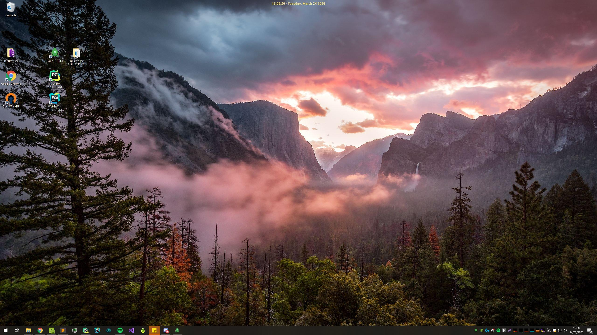

# windows top clock
Little plugin to display windows time as d3d hook from old good game hacking days.

### Things to know

- Been built with win32api, won't work on UNIX but you may be easily able to export the logic behind.
- To auto run at startup, cast WIN+R and type shell:startup, put (.EXE + .DLL) in it, reboot & enjoy.
- You may also put DLL at windows root system but for obvious reasons you should not.
- Some part of code have been took without credits, especially about drawing though but, I can't remember where I found thoses.
- .EXE have been compiled using nuitkka using : 
  `python@3.8 -m nuitka --follow-imports --include-plugin-directory=plugin_dir --windows-disable-console -- whatTime.py`
